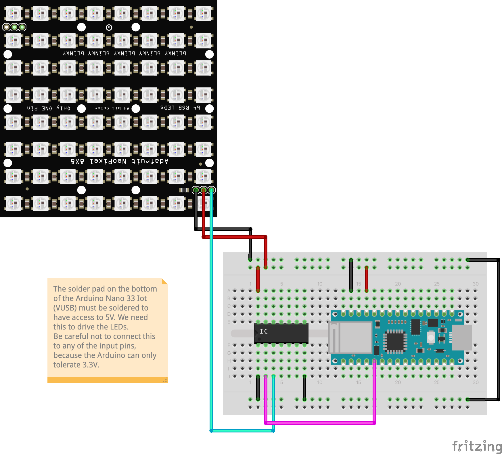

# Light-Cube Wiring

## Fritzing Installation

If looking at the wiring image (light-cube-wiring.png) is not enough and you want too view / edit the Fritzing file, you need to follow a few steps first:

1. Install [Fritzing](https://fritzing.org/)
2. Download the part *Adafruit NeoPixel NeoMatrix 8x8.fzpz* from [GitHub](https://github.com/adafruit/Fritzing-Library/blob/master/parts/Adafruit%20NeoPixel%20NeoMatrix%208x8.fzpz)
3. Downlod the part *NodeMCU v1.0* from [GitHub](https://github.com/squix78/esp8266-fritzing-parts/blob/master/nodemcu-v1.0/NodeMCUV1.0.fzpz)
4. Double click both files to open them in Fritzing
5. Open the Light-Cube Fritzing file

Please note: There is no Fritzing part for the *SN74AHCT125N logic level converter*, we just use an IC here with the same number of pins. The orientation of the part is so that its text can be read.

