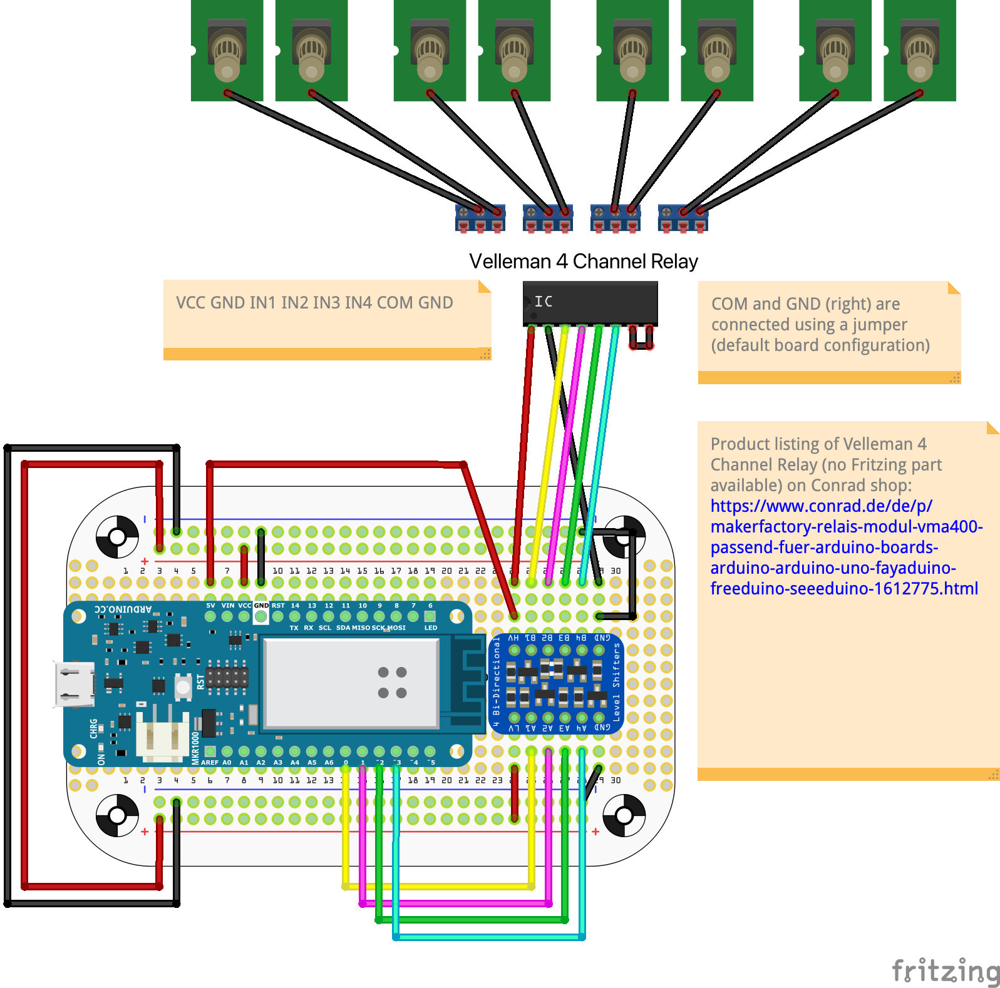

# Maker-Cube Wiring

## Fritzing Diagram

To view / edit the Fritzing file (for better resolution), you need to perform a few steps first:

1. Install [Fritzing](https://fritzing.org/)
2. Download the part *Adafruit PermaProto Mint Tin Size Breadboard* from [GitHub](https://github.com/adafruit/Fritzing-Library/blob/master/parts/Adafruit%20PermaProto%20Mint%20Tin%20Size%20Breadboard.fzpz)
3. Double click it to open it in Fritzing
4. Open the Maker-Cube Fritzing file

## Velleman VMA400 Board

The design does not contain the used relay board ([Velleman VMA400](https://www.velleman.eu/products/view/?id=435558)), but the Fritzing file uses the same port layout as this board, so you will be able to translate the design 1 to 1 to the board.

The IC symbolizes the Velleman VMA400 ports to the Arduino, the top part shows how to connect the outputs of the Velleman VMA400 board to the banana jacks.

